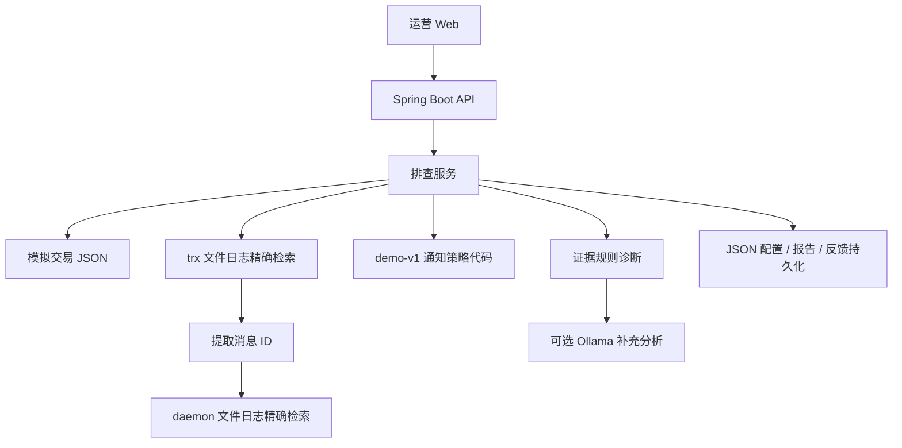

# 业务需求、技术架构与可行性

> 当前进度调整：先交付 frontend 纯前端原型。以下 Java 架构为后续实现草案，尚未完成后端验证。当前实际运行的是浏览器内置模拟数据与 localStorage，未连接数据库、文件日志、SSH 或模型。以 README 的启动方式和能力说明为准。

## 业务目标

为外卡支付运营提供只读排查：输入交易流水号和问题，获取交易状态、跨服务日志证据、可解释结论和人工处理建议。将需要开发处理的问题导出为排查单，并记录处理反馈。

第一版覆盖渠道拒绝、支付成功但商户通知失败、渠道超时最终状态未知。验收重点是证据正确关联、不得将超时判断为失败、缺失日志时明确说明不确定性。

## 当前架构

日志按结构化标识边界匹配，相邻行只展示为上下文。报告保留文件名、行号、匹配标识和原文。业务代码是与模拟日志配套的示例，不是实际运行的支付服务。模型不执行 shell、SQL 或支付操作。

配置支持 trx/daemon 启用开关，固定本地日志绑定、项目环境与版本。禁用服务会影响后续排查。当前不支持新增服务器、SSH 连接或 Git 索引。

## API

| 接口 | 用途 |
| --- | --- |
| GET /api/transactions | 演示交易列表 |
| POST /api/investigations | 输入 transactionId、question，执行排查 |
| GET /api/investigations | 最近 200 条排查报告 |
| GET /api/investigations/{id} | 查询报告 |
| POST /api/investigations/{id}/feedback | 保存 status、note |
| GET /api/services | 服务配置 |
| PUT /api/services | 保存完整服务启用配置 |
| GET /api/status | 模型配置状态，不代表模型健康状态 |

排查接口同步返回结果；界面等待时展示处理中状态，完成后展示真实执行记录，不模拟流式过程。最多两个并发排查。报告、配置、反馈通过临时文件原子替换保存，适合单进程演示。

## 数据与安全边界

仅包含模拟交易，不包含卡号、个人信息或生产密钥。默认监听回环地址。ngrok 展示必须配置 DEMO_PASSWORD。提供 HTTP Basic 登录、同源写请求检查、固定日志路径、输入约束和浏览器 CSP。模型只收到模拟报告；输出必须人工复核。

当前没有租户隔离、生产权限、全量审计、凭据保管或完整限流，不可直接作为生产服务。反馈不会自动修改知识或支付状态。

## 生产演进

1. 数据源接口：接入只读交易查询模板及 Elasticsearch/Loki；无集中日志时实现受控 SSH 适配器，支持时间窗、轮转文件、多实例、超时及截断标识。
2. 配置模型：项目、环境、服务、节点、凭据引用、部署 commit、标识映射。生产凭据不进入提示词。
3. 知识索引：按部署版本索引日志语句、错误码、通知规则及审核过的排查案例。
4. AI 编排：结构化工具参数，限定可查询服务、关联标识、步数与预算；报告引用证据，保留工具审计。
5. 基础设施：PostgreSQL、异步任务、SSE、SSO、商户权限、脱敏与保留周期。

## 演示与评估

主案例：T202609200001。查看支付成功证据，再沿 MSG77662 找 daemon 的三次超时与 RETRY_EXHAUSTED，解释通知失败并生成处理建议；不能仅凭超时断定商户未执行请求。

反例：T202609200003 必须保持未知；关闭 daemon 后，主案例不能给出确定的通知故障结论。日志包含其他交易干扰行，不能纳入证据。

评估记录：规则正确率、证据误关联数量、首次有效结论耗时、人工修正情况。真实开发介入减少比例需试点测量，不在 Demo 中虚构。模型质量和耗时受硬件与模型选择影响，尚未进行真实模型效果评测。

## 交付范围

包括可运行 Java/Web 代码、模拟日志与交易、真实文件检索、跨服务关联、证据报告、Markdown 导出、反馈持久化、服务开关、可选 Ollama 接入及测试。SSH、真实交易数据库、任意项目接入和自主工具编排不属于当前已实现能力。
